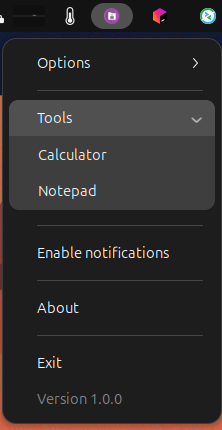

# ComposeTray Library

**ComposeTray** is a Kotlin library that provides a simple way to create system tray applications with native support for Linux, Windows, and macOS. This library allows you to add a system tray icon, tooltip, and menu with various options in a Kotlin DSL-style syntax.

## Features
- Cross-platform support for Linux, Windows, and macOS.
- DSL-style syntax to define tray menus with ease.
- Supports standard items, submenus, dividers, and checkable items.
- Ability to enable/disable menu items dynamically.

## Getting Started

### Installation

To use the ComposeTray library, add it as a dependency in your `build.gradle.kts` file:

```kotlin
dependencies {
    implementation("com.kdroid.composetray:composetray:0.1.0")
}
```

### Usage
Here's a basic example of how to use the ComposeTray library to create a system tray icon with a menu:

```kotlin
import com.kdroid.composetray.tray.api.NativeTray
import com.kdroid.kmplog.Log
import java.nio.file.Paths

fun main() {
    val iconPath = Paths.get("src/test/resources/icon.png").toAbsolutePath().toString()
    val windowsIconPath = Paths.get("src/test/resources/icon.ico").toAbsolutePath().toString()

    NativeTray(
        iconPath = iconPath,
        windowsIconPath = windowsIconPath,
        tooltip = "My Application",
        menuContent = {
            SubMenu(label = "Options") {
                Item(label = "Setting 1") {
                    Log.i("NativeTrayTest", "Setting 1 selected")
                }
                SubMenu(label = "Advanced Sub-options") {
                    Item(label = "Advanced Option 1") {
                        Log.i("NativeTrayTest", "Advanced Option 1 selected")
                    }
                    Item(label = "Advanced Option 2") {
                        Log.i("NativeTrayTest", "Advanced Option 2 selected")
                    }
                }
            }

            Divider()

            SubMenu(label = "Tools") {
                Item(label = "Calculator") {
                    Log.i("NativeTrayTest", "Calculator launched")
                }
                Item(label = "Notepad") {
                    Log.i("NativeTrayTest", "Notepad opened")
                }
            }

            Divider()

            CheckableItem(label = "Enable notifications") { isChecked ->
                Log.i("NativeTrayTest", "Notifications ${if (isChecked) "enabled" else "disabled"}")
            }

            Divider()

            Item(label = "About") {
                Log.i("NativeTrayTest", "Application v1.0 - Developed by Elyahou")
            }

            Divider()

            Item(label = "Exit", isEnabled = true) {
                Log.i("NativeTrayTest", "Exiting the application")
                dispose()
            }

            Item(label = "Version 1.0.0", isEnabled = false)
        }
    )
}
```

### Components of the Tray Menu
- **Item**: A standard clickable item that can be enabled or disabled.
- **CheckableItem**: A menu item with a checkbox that can be toggled on or off.
- **SubMenu**: A submenu that can contain multiple items, including other submenus.
- **Divider**: A separator used to visually separate menu items.
- **dispose**: Call to remove the system tray icon and exit gracefully.

### Platform-Specific Implementation
The `NativeTray` class automatically detects the operating system and initializes the appropriate tray implementation:
- **Linux**: Uses `LinuxTrayInitializer`.
- **Windows**: Uses `WindowsTrayInitializer`.
- **macOS**: Uses `AwtTrayInitializer`.

> Note: For Windows, you must use an `.ico` file for the tray icon, while for Linux and macOS, a `.png` file is required.

### Logging
This example uses the `kmplog` library for logging, which allows you to log messages when certain items are selected or toggled.

## Screenshots
Here are some screenshots of ComposeTray running on different platforms:

### Ubuntu


### Windows


## License
This library is licensed under the MIT License.

## Contributing
Feel free to open issues or pull requests if you find any bugs or have suggestions for new features.

## Acknowledgements
This library is developed and maintained by Elyahou, aiming to provide an easy and cross-platform system tray solution for Kotlin applications.

