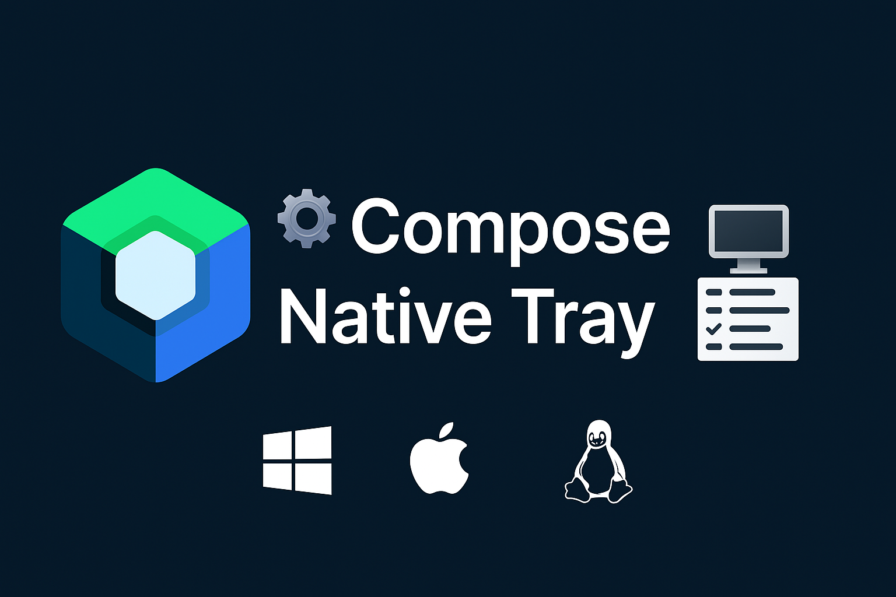
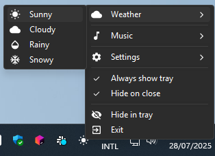
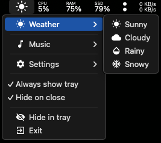
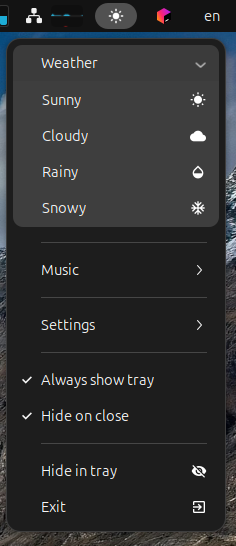
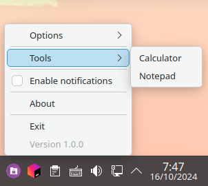

# 🛠️ Compose Native Tray

<p align="center">
  
</p>
<p align="center">
  <a href="https://central.sonatype.com/artifact/io.github.kdroidfilter/composenativetray"></a>
  <a href="https://opensource.org/licenses/MIT"></a>
  <a href="https://github.com/kdroidFilter/ComposeNativeTray"></a>
  <a href="https://github.com/kdroidFilter/ComposeNativeTray/commits/main"></a>
  <a href="https://kdroidfilter.github.io/ComposeNativeTray/"></a>
  <a href="https://github.com/kdroidFilter/ComposeNativeTray/issues"></a>
  <a href="https://github.com/kdroidFilter/ComposeNativeTray/actions"></a>
</p>

## 📖 Introduction

**Compose Native Tray** is a modern Kotlin library for creating applications with system tray icons, offering native support for Linux, Windows, and macOS. It uses an intuitive Kotlin DSL syntax and fixes issues with the standard Compose for Desktop solution.

<p align="center">
  
</p>

## 📑 Table of Contents

- [📖 Introduction](#-introduction)
- [🎯 Why Compose Native Tray?](#-why-compose-native-tray)
- [📸 Preview](#-preview)
- [⚡ Installation](#-installation)
- [🚀 Quick Start](#-quick-start)
- [📚 Usage Guide](#-usage-guide)
  - [🎨 Creating the System Tray Icon](#-creating-the-system-tray-icon)
  - [🖱️ Primary Action](#️-primary-action)
  - [📋 Building the Menu](#-building-the-menu)
  - [Icons with painterResource](#icons-with-painterresource)
- [🔧 Advanced Features](#-advanced-features)
  - [🔄 Fully Reactive System Menu](#-fully-reactive-system-menu)
  - [🔒 Single Instance Management](#-single-instance-management)
  - [📍 Position Detection](#-position-detection)
  - [🌓 Dark Mode Detection](#-dark-mode-detection)
  - [🎨 Icon Rendering Customization](#-icon-rendering-customization)
- [⚠️ Platform-Specific Notes](#️-platform-specific-notes)
  - [Icon Limitations](#icon-limitations)
  - [Theme Behavior](#theme-behavior)
- [📄 License](#-license)
- [🤝 Contribution](#-contribution)
- [👨‍💻 Author](#-author)

## 🎯 Why Compose Native Tray?

This library was created to solve several limitations of the standard Compose for Desktop solution:
- ✅ **Improved HDPI support** on Windows and Linux
- ✅ **Modern appearance** on Linux (no more Windows 95 look!)
- ✅ **Extended features**: checkable items, nested submenus, separators
- ✅ **Native primary action**: left-click on Windows/macOS, single-click (KDE) or double-click (GNOME) on Linux
- ✅ **Full Compose recomposition support**: fully reactive icon and menu, allowing dynamic updates of items, their states, and visibility

## 📸 Preview

<table>
  <tr>
    <td><br /><center>Windows</center></td>
    <td><br /><center>macOS</center></td>
  </tr>
  <tr>
    <td><br /><center>Ubuntu GNOME</center></td>
    <td><br /><center>Ubuntu KDE</center></td>
  </tr>
</table>

## ⚡ Installation

Add the dependency to your `build.gradle.kts`:

```kotlin
dependencies {
  implementation("io.github.kdroidfilter:composenativetray:<version>")
}
```

## 🚀 Quick Start

Minimal example to create a system tray icon with menu:

```kotlin
application {
  Tray(
    icon = Icons.Default.Favorite,
    tooltip = "My Application"
  ) {
    Item(label = "Settings") {
      println("Settings opened")
    }
    
    Divider()
    
    Item(label = "Exit") {
      exitProcess(0)
    }
  }
}
```

## 📚 Usage Guide

### 🎨 Creating the System Tray Icon

#### Option 1: Using an ImageVector
```kotlin
Tray(
  icon = Icons.Default.Favorite,
  tint = null,  // Optional: if null, the tint automatically adapts (white in dark mode, black in light mode) according to the isMenuBarInDarkMode() API
  tooltip = "My Application"
) { /* menu */ }
```

#### Option 2: Using a Painter
```kotlin
Tray(
  icon = painterResource(Res.drawable.myIcon),
  tooltip = "My Application"
) { /* menu */ }
```

#### Option 3: Using a Custom Composable
```kotlin
Tray(
  iconContent = {
    Canvas(modifier = Modifier.fillMaxSize()) { // Important to use fillMaxSize()!
      // A simple red circle as an icon
      drawCircle(
        color = Color.Red,
        radius = size.minDimension / 2,
        center = center
      )
    }
  },
  tooltip = "My Application"
) { /* menu */ }
```

> **⚠️ Important**: Always use `Modifier.fillMaxSize()` with `iconContent` for proper icon rendering.

#### Option 4: Platform-Specific Icons

This approach allows respecting the design conventions of each platform:
- **Windows**: Traditionally uses colored icons in the system tray
- **macOS/Linux**: Prefer monochrome icons that automatically adapt to the theme

```kotlin
val windowsIcon = painterResource(Res.drawable.myIcon)
val macLinuxIcon = Icons.Default.Favorite

Tray(
  windowsIcon = windowsIcon,      // Windows: full colored icon
  macLinuxIcon = macLinuxIcon,    // macOS/Linux: adaptive icon
  tooltip = "My Application"
) { /* menu */ }
```

> **💡 Note**: If no tint is specified, ImageVectors are automatically tinted white (dark mode) or black (light mode) based on the theme.

### 🖱️ Primary Action

Define an action for clicking on the icon. The behavior varies by platform:
- **Windows/macOS**: Left-click on the icon (native implementation for macOS)
- **Linux**: Single-click on KDE or double-click on GNOME (implementation via DBus)

```kotlin
Tray(
  icon = Icons.Default.Favorite,
  tooltip = "My Application",
  primaryAction = {
    println("Icon clicked!")
    // Open a window, display a menu, etc.
  }
) { /* menu */ }
```

### 📋 Building the Menu

> **Important note**: It's not mandatory to create a context menu. You can use only an icon in the tray with a primary action (left-click) to restore your application, as shown in the `DemoWithoutContextMenu.kt` example. This minimalist approach is perfect for simple applications that only need a restore function.

The menu uses an intuitive DSL syntax with several types of elements:

```kotlin
Tray(/* configuration */) {
  // Simple item with icon
  Item(label = "Open", icon = Icons.Default.OpenInNew) {
    // Click action
  }
  
  // Item with custom icon via iconContent
  Item(
    label = "Custom",
    iconContent = {
      Icon(
        Icons.Default.Star,
        contentDescription = null,
        tint = Color.Yellow,
        modifier = Modifier.fillMaxSize() // Important!
      )
    }
  ) { }
  
  // Checkable item
  CheckableItem(
    label = "Dark Mode",
    icon = Icons.Default.DarkMode,
    checked = isDarkMode,
    onCheckedChange = { isDarkMode = it }
  )
  
  // Submenu
  SubMenu(label = "Options", icon = Icons.Default.Settings) {
    Item(label = "Option 1") { }
    Item(label = "Option 2") { }
    
    // Nested submenus supported!
    SubMenu(label = "Advanced") {
      Item(label = "Advanced Option") { }
    }
  }
  
  // Visual separator
  Divider()
  
  // Disabled item
  Item(label = "Version 1.0.0", isEnabled = false)
  
  // Exit properly
  Item(label = "Exit") {
    dispose()  // Removes the system tray icon
    exitProcess(0)
  }
}
```

### Icons with painterResource
When using `painterResource` with menu items, declare it in the composable context:

```kotlin
application {
  val advancedIcon = painterResource(Res.drawable.advanced) // ✅ Correct
  
  Tray(/* config */) {
    SubMenu(
      label = "Advanced",
      icon = advancedIcon  // Use the variable
    ) { /* items */ }
  }
}
```

## 🔧 Advanced Features

### 🔄 Fully Reactive System Menu

The library supports Compose recomposition for all aspects of the system menu:

```kotlin
// Example 1: Dynamic display/hiding of the icon
var isWindowVisible by remember { mutableStateOf(true) }

// The icon only appears when the window is hidden
if (!isWindowVisible) {
  Tray(
    icon = Icons.Default.Favorite,
    tooltip = "Click to restore"
  ) {
    Item(label = "Restore") {
      isWindowVisible = true
    }
  }
}

// Example 2: Fully reactive menu
application {
  var darkMode by remember { mutableStateOf(false) }
  var showAdvancedOptions by remember { mutableStateOf(false) }
  var notificationsEnabled by remember { mutableStateOf(true) }

  Tray(
    // The icon changes based on the mode
    icon = if (darkMode) Icons.Default.DarkMode else Icons.Default.LightMode,
    tooltip = "My Application"
  ) {
    // Item with reactive label and icon
    Item(
      label = if (darkMode) "Switch to Light Mode" else "Switch to Dark Mode",
      icon = if (darkMode) Icons.Default.LightMode else Icons.Default.DarkMode
    ) {
      darkMode = !darkMode
    }

    // Reactive checkable item
    CheckableItem(
      label = "Notifications",
      checked = notificationsEnabled,
      onCheckedChange = { notificationsEnabled = it }
    )

    // Conditional display of items
    if (showAdvancedOptions) {
      Divider()

      SubMenu(label = "Advanced Options") {
        Item(label = "Configuration") { /* action */ }
        Item(label = "Diagnostics") { /* action */ }
      }
    }

    Divider()

    // Visibility control
    Item(
      label = if (showAdvancedOptions) "Hide Advanced Options" else "Show Advanced Options"
    ) {
      showAdvancedOptions = !showAdvancedOptions
    }
  }
}
```

All menu properties (icon, labels, states, item visibility) are reactive and update automatically when application states change, without requiring manual recreation of the menu.

### 🔒 Single Instance Management

Prevent multiple instances of your application:

The single instance manager combined with the primary action (left-click) is particularly useful for restoring a minimized application in the tray rather than opening a new instance. This improves the user experience by:
- Avoiding resource duplication and confusion with multiple windows
- Preserving the current state of the application during restoration
- Offering behavior similar to native system applications

Implementation example with `SingleInstanceManager`:

```kotlin
var isWindowVisible by remember { mutableStateOf(true) }

val isSingleInstance = SingleInstanceManager.isSingleInstance(
  onRestoreRequest = {
    isWindowVisible = true  // Restore the existing window
  }
)

if (!isSingleInstance) {
  exitApplication()
  return@application
}
```

#### Custom Configuration

For finer control, configure the `SingleInstanceManager`:

```kotlin
SingleInstanceManager.configuration = Configuration(
  lockFilesDir = Paths.get("path/to/your/app/data/dir/single_instance_manager"),
  appIdentifier = "app_id"
)
```

This allows limiting the scope of the single instance to a specific directory or identifying different versions of your application.

### 📍 Position Detection

Precisely position your windows relative to the system tray icon:

```kotlin
val windowWidth = 800
val windowHeight = 600
val windowPosition = getTrayWindowPosition(windowWidth, windowHeight)

Window(
  state = rememberWindowState(
    width = windowWidth.dp,
    height = windowHeight.dp,
    position = windowPosition
  )
) { /* content */ }
```

**Implementation Details:**
- **Windows**: Uses the Windows native API to get the exact position
- **macOS**: Uses the Cocoa API for the position in the menu bar
- **Linux**: Captures coordinates when clicking on the icon

The window is automatically horizontally centered on the icon and vertically positioned based on whether the system tray is at the top or bottom of the screen.

### 🌓 Dark Mode Detection

Automatically adapt your icons to the theme:

```kotlin
val isMenuBarDark = isMenuBarInDarkMode()

Tray(
  iconContent = {
    Icon(
      Icons.Default.Favorite,
      contentDescription = "",
      tint = if (isMenuBarDark) Color.White else Color.Black,
      modifier = Modifier.fillMaxSize()
    )
  },
  tooltip = "My Application"
) { /* menu */ }
```

**Platform Behavior:**
- **macOS**: The menu bar depends on the wallpaper, not the system theme
- **Windows**: Follows the system theme
- **Linux**: GNOME/XFCE/CINNAMON/MATE always dark, KDE follows the theme

> **💡 macOS Note**: The system tray icon follows the menu bar color (based on the wallpaper), but the menu item icons follow the system theme.

### 🎨 Icon Rendering Customization

Two options for customizing rendering:

```kotlin
// Option 1: Optimized for the current OS
Tray(
  icon = Icons.Default.Favorite,
  iconRenderProperties = IconRenderProperties.forCurrentOperatingSystem(
    sceneWidth = 192,    // Compose scene width
    sceneHeight = 192,   // Compose scene height
    density = Density(2f) // Rendering density
  )
) { /* menu */ }

// Option 2: Without forced scaling
Tray(
  icon = Icons.Default.Favorite,
  iconRenderProperties = IconRenderProperties.withoutScalingAndAliasing(
    sceneWidth = 192,
    sceneHeight = 192,
    density = Density(2f)
  )
) { /* menu */ }
```

By default, icons are optimized by OS: 32x32px (Windows), 44x44px (macOS), 24x24px (Linux).

## ⚠️ Platform-Specific Notes

### Icon Limitations
- **GNOME**: Icons don't display in submenus
- **Windows**: Checkable items with icons don't display the check indicator

### Theme Behavior
- **macOS**: The menu bar color depends on the wallpaper, not the system theme
- **Windows**: Follows the system theme
- **Linux**: Varies by desktop environment (GNOME/KDE/etc.)

## 📄 License

This library is licensed under the MIT License. The Linux module uses LGPL v2.1.

## 🤝 Contribution

Contributions are welcome! Feel free to:
- Report bugs via issues
- Propose new features
- Submit pull requests
- Share your projects using this library

## 👨‍💻 Author

Developed and maintained by **Elie Gambache** with the goal of providing a modern, cross-platform solution for system tray icons in Kotlin.