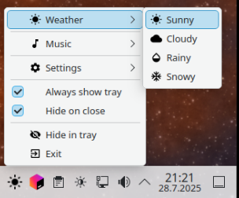

# 🛠️ Compose Native Tray Library

<p align="center">
  
</p>
<p align="center">
  <a href="https://central.sonatype.com/artifact/io.github.kdroidfilter/composenativetray"></a>
  <a href="https://opensource.org/licenses/MIT"></a>
  <a href="https://github.com/kdroidFilter/ComposeNativeTray"></a>
  <a href="https://github.com/kdroidFilter/ComposeNativeTray/commits/main"></a>
  <a href="https://kdroidfilter.github.io/ComposeNativeTray/"></a>
  <a href="https://github.com/kdroidFilter/ComposeNativeTray/issues"></a>
  <a href="https://github.com/kdroidFilter/ComposeNativeTray/actions"></a>
</p>
**Compose Native Tray** is a Kotlin library that provides a simple way to create system tray applications with native support for Linux, Windows, and macOS. This library was created to address several issues with the Compose for Desktop tray, including poor HDPI support on Windows and Linux, as well as the outdated appearance of the tray on Linux, which resembled Windows 95. In addition to these fixes, ComposeTray also adds support for checkable items, dividers, submenus, and even nested submenus, offering a more feature-rich and modern solution. The Linux implementation uses GTK, while macOS uses AWT, and the Windows implementation is based on native system calls. Additionally, it allows you to enable or disable individual tray items dynamically. This library allows you to add a system tray icon, tooltip, and menu with various options in a Kotlin DSL-style syntax.


## ✨ Features

- Cross-platform support for Linux, Windows, and macOS.
- DSL-style syntax to define tray menus with ease.
- Supports standard items, submenus, dividers, and checkable items.
- Ability to enable/disable menu items dynamically.
- Corrects issues with the [Compose for Desktop tray](https://github.com/JetBrains/compose-multiplatform/blob/master/tutorials/Tray_Notifications_MenuBar_new), particularly HDPI support on Windows and Linux.
- Improves the appearance of the tray on Linux, which previously resembled Windows 95.
- Adds support for checkable items, dividers, and submenus, including nested submenus.
- Supports primary action for Windows, macOS, and Linux.
  - On Windows, the primary action is triggered by a left-click on the tray icon.
  - On macOS, the primary action is triggered by a left-click on the tray icon using a native implementation.
  - On Linux, the primary action is triggered by a left-click on KDE and a double left-click on GNOME, using a dbus-based implementation.
- **Single Instance Management**: Ensures that only one instance of the application can run at a time and allows restoring focus to the running instance when another instance is attempted.
- **Tray Position Detection**: Allows determining the position of the system tray, which helps in positioning related windows appropriately.
- **Compose Recomposition Support**: The tray supports Compose recomposition, making it possible to dynamically show or hide the tray icon, for example:

<p align="center">
  
</p>

  ```kotlin
  var isWindowVisible by remember { mutableStateOf(true) }

  if (!isWindowVisible) {
      Tray(
          // Tray parameters
      )
  }
  ```

## 🚀 Getting Started

### 📦 Installation

To use the ComposeTray library, add it as a dependency in your `build.gradle.kts` file:

```kotlin
dependencies {
  implementation("io.github.kdroidfilter:composenativetray:<version>")
}
```

### 🛠️ Usage

Here's a basic example of how to use the ComposeTray library to create a system tray icon with a menu:
The `Tray` must be executed inside an Application Scope, like this:

> **Important**: When using a Composable for the tray icon, it's crucial to apply the `Modifier.fillMaxSize()` to your Composable. This ensures that the Composable fills the entire image when it's converted to an icon. Without this modifier, your icon may appear smaller than intended or not properly centered.

#### Using a Composable for the tray icon

````kotlin
application {
  Tray(
    iconContent = {
      Icon(
        Icons.Default.Favorite,
        contentDescription = "",
        tint = Color.Unspecified, // If not defined icon will be tinted with LocalContentColor.current
        modifier = Modifier.fillMaxSize() // This is crucial!
      )
    },
    tooltip = "My Application",
    primaryAction = {
      println("$logTag: Primary action triggered")
    }
  ) {
    SubMenu(label = "Options") {
      Item(label = "Setting 1") {
        println("$logTag: Setting 1 selected")
      }
      SubMenu(label = "Advanced Sub-options") {
        Item(label = "Advanced Option 1") {
          println("$logTag: Advanced Option 1 selected")
        }
        Item(label = "Advanced Option 2") {
          println("$logTag: Advanced Option 2 selected")
        }
      }
    }

    Divider()

    SubMenu(label = "Tools") {
      Item(label = "Calculator") {
        println("$logTag: Calculator launched")
      }
      Item(label = "Notepad") {
        println("$logTag: Notepad opened")
      }
    }

    Divider()

    CheckableItem(label = "Enable notifications") { isChecked ->
      println("$logTag: Notifications ${if (isChecked) "enabled" else "disabled"}")
    }

    Divider()

    Item(label = "About") {
      println("$logTag: Application v1.0 - Developed by Elyahou")
    }

    Divider()

    Item(label = "Exit", isEnabled = true) {
      println("$logTag: Exiting the application")
      dispose()
      exitProcess(0)
    }

    Item(label = "Version 1.0.0", isEnabled = false)
  }
}
````

#### Using an ImageVector directly for the tray icon

```kotlin
application {
  Tray(
    icon = Icons.Default.Favorite,  // Using ImageVector directly
    tint = Color.Red,  // Optional: Apply a tint color (null means auto-adapt to theme)
    tooltip = "My Application",
    primaryAction = {
      println("$logTag: Primary action triggered")
    }
  ) {
    // Menu items...
  }
}
```

#### Using a Painter directly for the tray icon

```kotlin
application {
  Tray(
    icon = painterResource(Res.drawable.myIcon),  // Using Painter directly
    tooltip = "My Application",
    primaryAction = {
      println("$logTag: Primary action triggered")
    }
  ) {
    // Menu items...
  }
}
```

#### Using icons with menu items

Menu items, checkable items, and submenus can also use icons:

```kotlin
application {
  // Declare icon variables in the composable context
  val homeIcon = painterResource(Res.drawable.home)
  val advancedIcon = painterResource(Res.drawable.advanced)
  
  Tray(
    // Tray configuration...
  ) {
    // Menu item with ImageVector icon
    Item(
      label = "Settings",
      icon = Icons.Default.Settings,
      iconTint = Color.Blue  // Optional
    ) {
      println("$logTag: Settings selected")
    }
    
    // Menu item with Painter icon
    Item(
      label = "Home",
      icon = homeIcon  // Using the variable declared above
    ) {
      println("$logTag: Home selected")
    }
    
    // Checkable item with ImageVector icon
    CheckableItem(
      label = "Dark Mode",
      icon = Icons.Default.DarkMode,
      checked = isDarkMode,
      onCheckedChange = { isChecked ->
        isDarkMode = isChecked
      }
    )
    
    // Submenu with Painter icon
    SubMenu(
      label = "Advanced",
      icon = advancedIcon  // Using the variable declared above
    ) {
      // Submenu items...
    }
  }
}
```

#### Using Composable icons with iconContent

Menu items, checkable items, and submenus can also use custom Composable icons via the `iconContent` parameter:

```kotlin
application {
  Tray(
    // Tray configuration...
  ) {
    // Menu item with Composable icon using iconContent
    Item(
      label = "Custom Icon",
      iconContent = {
        // Just like with the tray icon, using Modifier.fillMaxSize() is crucial!
        Icon(
          imageVector = Icons.Default.Star,
          contentDescription = null,
          tint = Color.Yellow,
          modifier = Modifier.fillMaxSize() // This is crucial!
        )
      }
    ) {
      println("$logTag: Custom icon item selected")
    }
    
    // Checkable item with Composable icon
    CheckableItem(
      label = "Custom Checkable",
      iconContent = {
        // Always use Modifier.fillMaxSize() for proper sizing
        Icon(
          imageVector = Icons.Default.Favorite,
          contentDescription = null,
          tint = Color.Red,
          modifier = Modifier.fillMaxSize() // This is crucial!
        )
      },
      checked = isCustomEnabled,
      onCheckedChange = { isChecked ->
        isCustomEnabled = isChecked
      }
    )
    
    // Submenu with Composable icon
    SubMenu(
      label = "Custom Submenu",
      iconContent = {
        // Always use Modifier.fillMaxSize() for proper sizing
        Icon(
          imageVector = Icons.Default.Menu,
          contentDescription = null,
          tint = Color.Green,
          modifier = Modifier.fillMaxSize() // This is crucial!
        )
      }
    ) {
      // Submenu items...
    }
  }
}
```

> **Important**: When using `iconContent` for menu items, just like with the tray icon, it's crucial to apply the `Modifier.fillMaxSize()` to your Composable. This ensures that the Composable fills the entire image when it's converted to an icon. Without this modifier, your icon may appear smaller than intended or not properly centered.

### 📋 Components of the Tray Menu
- **Item**: A standard clickable item that can be enabled or disabled. Can include an icon using ImageVector, Painter, or a custom Composable via iconContent.
- **CheckableItem**: A menu item with a checkbox that can be toggled on or off. Can include an icon using ImageVector, Painter, or a custom Composable via iconContent.
- **SubMenu**: A submenu that can contain multiple items, including other submenus. Can include an icon using ImageVector, Painter, or a custom Composable via iconContent.
- **Divider**: A separator used to visually separate menu items.
- **dispose**: Call to remove the system tray icon and exit gracefully.
- **Primary Action**: An action triggered by a left-click on the tray icon on Windows and macOS, and by a left-click on KDE or double left-click on GNOME for Linux.
- **Tray Icon**: Can be specified using a file path, a Composable function, an ImageVector, or a Painter.

### 🖼️ Using painterResource with Menu Items

When using `painterResource` with menu items, you need to be aware that `painterResource` is a composable function that must be called within a composable context. While it works directly in the Tray component (which is a composable function), it cannot be used directly as a parameter to menu items.

#### ❌ This won't work:

```kotlin
application {
  Tray(
    // Tray configuration...
  ) {
    // This will cause an error because painterResource is called outside a composable context
    SubMenu(
      label = "Advanced",
      icon = painterResource(Res.drawable.advanced)  // Error!
    ) {
      // Submenu items...
    }
  }
}
```

#### ✅ Use this workaround instead:

```kotlin
application {
  // Declare the icon variable in the composable context
  val advancedIcon = painterResource(Res.drawable.advanced)
  
  Tray(
    // Tray configuration...
  ) {
    // Now use the variable in the menu item
    SubMenu(
      label = "Advanced",
      icon = advancedIcon  // Works correctly!
    ) {
      // Submenu items...
    }
  }
}
```

This workaround ensures that `painterResource` is called within the composable context of the application, and the resulting Painter is then passed to the menu item.

### ⚠️ Platform-Specific Icon Limitations

When using icons with menu items, be aware of the following platform-specific limitations:

- **GNOME**: Icons are not displayed in submenus. Even if you specify an icon for a submenu item, it will not be visible under GNOME.
  
- **Windows**: When a checkable item has an icon, the check indicator will not be displayed. This means users won't be able to visually determine if the item is checked or not.

These limitations are due to the underlying system implementations and cannot be fixed within the library.

**Recommendation**: For consistent cross-platform behavior, it's advised to avoid using icons on submenus and checkable items. This ensures a uniform user experience across all supported platforms.

### 🌓 Menu Bar Dark Mode Detection

The library provides a reactive API called `isMenuBarInDarkMode()` that detects whether the menu bar is in dark mode. This API is particularly useful for automatically adapting your tray icon and menu item icons to match the current theme.

#### Platform-Specific Behavior

The behavior of `isMenuBarInDarkMode()` varies by platform:

- **macOS**: On macOS, the menu bar color is based on the wallpaper, not the system theme. This means the menu bar can be dark even if the system is using a light theme, or vice versa. The API detects this accurately and reactively.

- **Windows**: On Windows, the menu bar color follows the system theme. The API returns `true` when the system is in dark mode.

- **Linux**: The behavior depends on the desktop environment:
  - **GNOME, XFCE, CINNAMON, MATE**: Always returns `true` (always dark)
  - **KDE**: Based on the system theme
  - **Other**: Falls back to the system theme

#### Automatic Icon Tinting

When using ImageVector icons with the library, they are automatically tinted based on the menu bar theme if no explicit tint is specified:

- In dark mode: Icons are automatically tinted **white**
- In light mode: Icons are automatically tinted **black**

This applies to both the tray icon and menu item icons, with one important exception:

> **Note**: On macOS, while the tray icon is tinted based on the menu bar theme (which depends on the wallpaper), menu item icons are tinted based on the system theme. This is because macOS menu items follow the system theme rather than the menu bar theme.

#### Example Usage

Here's an example of using an ImageVector for the tray icon with automatic tinting:

```kotlin
application {
  Tray(
    icon = Icons.Default.Favorite,  // Using ImageVector directly
    // No tint specified, so it will automatically adapt to the menu bar theme
    tooltip = "My Application",
    primaryAction = {
      println("$logTag: Primary action triggered")
    }
  ) {
    // Menu items...
  }
}
```

You can also explicitly check the menu bar theme in your composable:

```kotlin
application {
  val isMenuBarDark = isMenuBarInDarkMode()
  
  Tray(
    iconContent = {
      Icon(
        Icons.Default.Favorite,
        contentDescription = "",
        tint = if (isMenuBarDark) Color.White else Color.Black,
        modifier = Modifier.fillMaxSize()
      )
    },
    tooltip = "My Application"
  ) {
    // Menu items...
  }
}
```

This API is fully reactive, meaning your UI will automatically update when the menu bar theme changes, without requiring any manual refresh.

### 🎨 Icon Rendering Customization

The `IconRenderProperties` class allows you to customize how your tray icon is rendered. This is an optional parameter when using the Tray component, with a default value already provided:

```kotlin
iconRenderProperties = IconRenderProperties.forCurrentOperatingSystem()
```

#### Available Factory Methods:

1. **forCurrentOperatingSystem()**: Creates properties optimized for the current operating system:
   - Windows: 32x32 pixels
   - macOS: 44x44 pixels
   - Linux: 24x24 pixels

   ```kotlin
   IconRenderProperties.forCurrentOperatingSystem(
       sceneWidth = 192,    // Optional: Width of the compose scene (default: 192)
       sceneHeight = 192,   // Optional: Height of the compose scene (default: 192)
       density = Density(2f) // Optional: Density for the compose scene (default: 2f)
   )
   ```

2. **withoutScalingAndAliasing()**: Creates properties that don't force icon scaling and aliasing:

   ```kotlin
   IconRenderProperties.withoutScalingAndAliasing(
       sceneWidth = 192,    // Optional: Width of the compose scene (default: 192)
       sceneHeight = 192,   // Optional: Height of the compose scene (default: 192)
       density = Density(2f) // Optional: Density for the compose scene (default: 2f)
   )
   ```

This allows you to fine-tune how your icon appears in the system tray across different platforms.

### 🔄 Single Instance Management

The `SingleInstanceManager` ensures that only one instance of the application is running at a time. When a second instance tries to start, it sends a restore request to the existing instance to bring it to the foreground.

#### **Usage**
To use the `SingleInstanceManager`, include it as follows:

```kotlin
var isWindowVisible by remember { mutableStateOf(true) }

val isSingleInstance = SingleInstanceManager.isSingleInstance(onRestoreRequest = {
  isWindowVisible = true
})

if (!isSingleInstance) {
  exitApplication()
  return@application
}
```

In this example, the `SingleInstanceManager` will check if an instance is already running. If not, it will acquire the lock and start watching for restore requests. If an instance is already running, it will send a restore request to bring the existing window to the foreground, allowing you to focus on the already-running application rather than starting a new instance.

#### Configuration

`SingleInstanceManager` can be configured:
```kotlin
SingleInstanceManager.configuration = Configuration(
    lockFilesDir = Paths.get("path/to/your/app/data/dir/single_instance_manager"),
    appIdentifier = "app_id"
)
```
This is useful when you need single-instance management but want finer-grained control.

By specifying a custom `lockFilesDir`, you limit the scope of single-instance management
from every instance of your app on the whole system to only those that share the specified data directory.

Setting the custom `appIdentifier` can be used for even more granular control.

### 📌 Tray Position Detection

The tray position detection feature allows you to precisely position windows relative to the system tray icon. This feature has been significantly enhanced to provide exact positioning capabilities across all supported platforms.

#### Key Features

- **Precise Icon Coordinates**: The library now captures the exact coordinates of the tray icon, not just the general corner position.
- **Centered Window Positioning**: Windows are positioned precisely relative to the tray icon, centered horizontally on the icon.
- **Cross-Platform Support**: Works on Windows, macOS, and Linux with appropriate fallbacks when precise coordinates aren't available.
- **Automatic Boundary Handling**: Ensures windows stay within screen boundaries while maintaining optimal positioning.

The API provides two main functions:

1. `getTrayPosition()`: Returns the general position of the system tray (TOP_LEFT, TOP_RIGHT, BOTTOM_LEFT, BOTTOM_RIGHT).
2. `getTrayWindowPosition(windowWidth: Int, windowHeight: Int)`: Returns a `WindowPosition` that places a window of the specified dimensions precisely relative to the tray icon.

#### Implementation Details

- **Windows**: Uses native Windows API to get the exact notification area icon position.
- **macOS**: Uses Cocoa API to get the exact status item position in the menu bar.
- **Linux**: Captures click coordinates when the tray icon is clicked (left-click on KDE, double left-click on GNOME).

#### **Usage**
To use the tray position detection feature:

```kotlin
val windowWidth = 800
val windowHeight = 600
val windowPosition = getTrayWindowPosition(windowWidth, windowHeight)

Window(
  state = rememberWindowState(
    width = windowWidth.dp,
    height = windowHeight.dp,
    position = windowPosition
  ),
  // other window parameters
)
```

In this example, `getTrayWindowPosition` determines the optimal position for the window based on the exact location of the tray icon. The window will be centered horizontally on the icon and positioned vertically based on whether the tray is at the top or bottom of the screen, creating a seamless and user-friendly experience.

## 📸 Screenshots

Here are some screenshots of ComposeTray running on different platforms:

### Windows


### MacOS


### Ubuntu Gnome


### Ubuntu KDE


## 📄 License

This library is licensed under the MIT License.

The Linux module is available at https://github.com/kdroidFilter/LibLinuxTray and is licensed under the GNU Lesser General Public License (LGPL) version 2.1. As a result, the binary for the Linux module is also under LGPL.

## 🤝 Contributing

Feel free to open issues or pull requests if you find any bugs or have suggestions for new features. If you have other ideas for improvements or new functionalities, please let me know! If you use this library in your project, I would be happy to link to those projects as well.


## 🙏 Acknowledgements

This library is developed and maintained by Elie Gambache, aiming to provide an easy and cross-platform system tray solution for Kotlin applications.
