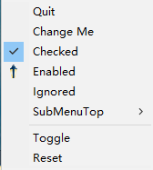

# Systray

systray is a Linux-only Go library to place an icon and menu in the notification area.
This repository is a fork of [getlantern/systray](https://github.com/getlantern/systray)
removing the GTK dependency and support for legacy linux system tray.

## Features

* Supported on Linux and many BSD systems
* Menu items can be checked and/or disabled
* Methods may be called from any Goroutine
* tray icon supports mouse click, double click, and right click

## API

```go
package main

import "github.com/energye/systray"
import "github.com/energye/systray/icon"

func main() {
	systray.Run(onReady, onExit)
}

func onReady() {
	systray.SetIcon(icon.Data)
	systray.SetTitle("Awesome App")
	systray.SetTooltip("Pretty awesome超级棒")
	systray.SetOnClick(func() {
		fmt.Println("SetOnClick")
	})
	systray.SetOnDClick(func() {
		fmt.Println("SetOnDClick")
	})
	systray.SetOnRClick(func(menu systray.IMenu) {
		menu.ShowMenu()
		fmt.Println("SetOnRClick")
	})
	mQuit := systray.AddMenuItem("Quit", "Quit the whole app")

	// Sets the icon of a menu item.
	mQuit.SetIcon(icon.Data)
}

func onExit() {
	// clean up here
}
```

### Run in another toolkit

Most graphical toolkits will grab the main loop so the `Run` code above is not possible.
For this reason there is another entry point `RunWithExternalLoop`.
This function of the library returns a start and end function that should be called
when the application has started and will end, to loop in appropriate features.

Note: this package requires cgo, so make sure you set `CGO_ENABLED=1` before building.

## Try the example app!

Have go v1.12+ or higher installed? Here's an example to get started on Linux:

```sh
git clone https://github.com/energye/systray
cd systray/example
go run .
```

Now look for *Awesome App* in your system tray!



## Platform notes

### Linux/BSD

This implementation uses DBus to communicate through the SystemNotifier/AppIndicator spec, older tray implementations may not load the icon.

If you are running an older desktop environment, or system tray provider, you may require a proxy app which can convert the new DBus calls to the old format.
The recommended tool for Gnome based trays is [snixembed](https://git.sr.ht/~steef/snixembed), others are available.
Search for "StatusNotifierItems XEmbedded" in your package manager.

## Credits

- https://github.com/getlantern/systray
- https://github.com/xilp/systray
- https://github.com/cratonica/trayhost

# Systray

systray is a Linux-only Go library to place an icon and menu in the notification area.
This repository is a fork of [getlantern/systray](https://github.com/getlantern/systray)
removing the GTK dependency and support for legacy linux system tray.

## Features

* Supported on Linux and many BSD systems
* Menu items can be checked and/or disabled
* Methods may be called from any Goroutine
* tray icon supports mouse click, double click, and right click

## API

```go
package main

import "github.com/energye/systray"
import "github.com/energye/systray/icon"

func main() {
	systray.Run(onReady, onExit)
}

func onReady() {
	systray.SetIcon(icon.Data)
	systray.SetTitle("Awesome App")
	systray.SetTooltip("Pretty awesome超级棒")
	systray.SetOnClick(func() {
		fmt.Println("SetOnClick")
	})
	systray.SetOnDClick(func() {
		fmt.Println("SetOnDClick")
	})
	systray.SetOnRClick(func(menu systray.IMenu) {
		menu.ShowMenu()
		fmt.Println("SetOnRClick")
	})
	mQuit := systray.AddMenuItem("Quit", "Quit the whole app")

	// Sets the icon of a menu item.
	mQuit.SetIcon(icon.Data)
}

func onExit() {
	// clean up here
}
```

### Run in another toolkit

Most graphical toolkits will grab the main loop so the `Run` code above is not possible.
For this reason there is another entry point `RunWithExternalLoop`.
This function of the library returns a start and end function that should be called
when the application has started and will end, to loop in appropriate features.

Note: this package requires cgo, so make sure you set `CGO_ENABLED=1` before building.

## Try the example app!

Have go v1.12+ or higher installed? Here's an example to get started on Linux:

```sh
git clone https://github.com/energye/systray
cd systray/example
go run .
```

Now look for *Awesome App* in your system tray!


## Platform notes

### Linux/BSD

This implementation uses DBus to communicate through the SystemNotifier/AppIndicator spec, older tray implementations may not load the icon.

If you are running an older desktop environment, or system tray provider, you may require a proxy app which can convert the new DBus calls to the old format.
The recommended tool for Gnome based trays is [snixembed](https://git.sr.ht/~steef/snixembed), others are available.
Search for "StatusNotifierItems XEmbedded" in your package manager.

## Utilisation en tant que bibliothèque partagée (.so) avec JNA (Kotlin)

Ce dépôt peut maintenant être compilé en bibliothèque partagée Linux (.so) utilisable depuis la JVM via JNA, y compris depuis Kotlin.

### 1) Construire la bibliothèque partagée

Prérequis: Go avec CGO activé, un toolchain C, et un environnement Linux.

- Via Makefile:

```sh
make build-so
```

Cette cible Makefile applique des options d'optimisation pour minimiser la taille de la bibliothèque (.so): -trimpath, -ldflags "-s -w -buildid= ...", CGO_CFLAGS=-Os, GC des sections (--gc-sections) et strip final.

- Ou manuellement:

```sh
GOOS=linux GOARCH=amd64 CGO_ENABLED=1 go build -buildmode=c-shared -o dist/libsystray.so ./jna
# Le fichier d'en-tête C généré sera: dist/libsystray.h
```

Le build génère:
- dist/libsystray.so: la bibliothèque native à charger via JNA
- dist/libsystray.h: l'en-tête C décrivant les symboles exportés

### 2) API C exportée (pour JNA)

Les fonctions suivantes sont exposées par la bibliothèque .so:
- void Systray_InitCallbacks(void_cb ready, void_cb exit, void_cb onClick, void_cb onRClick, menu_item_cb onMenuItem)
- void Systray_Run()
- void Systray_PrepareExternalLoop()
- void Systray_NativeStart()
- void Systray_NativeEnd()
- void Systray_Quit()
- void Systray_SetIcon(const char* bytes, int length)
- void Systray_SetTitle(const char* title)
- void Systray_SetTooltip(const char* tooltip)
- unsigned int Systray_AddMenuItem(const char* title, const char* tooltip)
- unsigned int Systray_AddMenuItemCheckbox(const char* title, const char* tooltip, int checked)
- // Sous-menus et opérations par item:
- unsigned int Systray_AddSubMenuItem(unsigned int parentId, const char* title, const char* tooltip)
- unsigned int Systray_AddSubMenuItemCheckbox(unsigned int parentId, const char* title, const char* tooltip, int checked)
- int Systray_MenuItem_SetTitle(unsigned int id, const char* title)
- void Systray_MenuItem_Enable(unsigned int id)
- void Systray_MenuItem_Disable(unsigned int id)
- void Systray_MenuItem_Show(unsigned int id)
- void Systray_MenuItem_Hide(unsigned int id)
- void Systray_MenuItem_Check(unsigned int id)
- void Systray_MenuItem_Uncheck(unsigned int id)
- void Systray_SetMenuItemIcon(const char* bytes, int length, unsigned int id)
- void Systray_AddSeparator()
- void Systray_ResetMenu()

Notes:
- Les callbacks sont optionnels (passez NULL si vous n'en avez pas besoin). Les callbacks sont invoqués sur le thread de l'event loop.
- La fonction onMenuItem reçoit l'ID (uint32) de l'item cliqué. Les fonctions AddMenuItem... renvoient cet ID.
- Systray_Run() est bloquante. Si vous avez déjà une boucle d'événements dans votre app, utilisez le trio: Systray_PrepareExternalLoop() puis Systray_NativeStart() et Systray_NativeEnd().

### 3) Exemple d'utilisation avec Kotlin/JNA

Ajoutez JNA dans vos dépendances (Gradle Kotlin DSL):

```kotlin
dependencies {
    implementation("net.java.dev.jna:jna:5.14.0")
}
```

Déclarez les interfaces JNA qui mappent la lib native:

```kotlin
import com.sun.jna.Callback
import com.sun.jna.Library
import com.sun.jna.Native
import com.sun.jna.NativeLibrary
import com.sun.jna.Pointer

interface SystrayNative : Library {
    fun Systray_InitCallbacks(ready: VoidCb?, exit: VoidCb?, onClick: VoidCb?, onRClick: VoidCb?, onMenuItem: MenuItemCb?)
    fun Systray_Run()
    fun Systray_PrepareExternalLoop()
    fun Systray_NativeStart()
    fun Systray_NativeEnd()
    fun Systray_Quit()
    fun Systray_SetIcon(bytes: Pointer, length: Int)
    fun Systray_SetTitle(title: String?)
    fun Systray_SetTooltip(tooltip: String?)
    fun Systray_AddMenuItem(title: String?, tooltip: String?): Int
    fun Systray_AddMenuItemCheckbox(title: String?, tooltip: String?, checked: Int): Int
    fun Systray_AddSeparator()
    fun Systray_ResetMenu()
    // New: submenu and per-item operations
    fun Systray_AddSubMenuItem(parentId: Int, title: String?, tooltip: String?): Int
    fun Systray_AddSubMenuItemCheckbox(parentId: Int, title: String?, tooltip: String?, checked: Int): Int
    fun Systray_MenuItem_SetTitle(id: Int, title: String?): Int
    fun Systray_MenuItem_Enable(id: Int)
    fun Systray_MenuItem_Disable(id: Int)
    fun Systray_MenuItem_Show(id: Int)
    fun Systray_MenuItem_Hide(id: Int)
    fun Systray_MenuItem_Check(id: Int)
    fun Systray_MenuItem_Uncheck(id: Int)
    fun Systray_SetMenuItemIcon(bytes: Pointer, length: Int, id: Int)
}

interface VoidCb : Callback { fun invoke() }
interface MenuItemCb : Callback { fun invoke(id: Int) }

object SystrayLib {
    val INSTANCE: SystrayNative by lazy {
        // Assurez-vous que libsystray.so est dans java.library.path ou LD_LIBRARY_PATH
        NativeLibrary.addSearchPath("systray", "/chemin/vers/dist")
        Native.load("systray", SystrayNative::class.java)
    }
}
```

Utilisation dans votre app Kotlin (exemple simple):

```kotlin
fun main() {
    val lib = SystrayLib.INSTANCE

    lib.Systray_InitCallbacks(
        ready = object : VoidCb { override fun invoke() { println("systray prêt") } },
        exit  = object : VoidCb { override fun invoke() { println("systray exit") } },
        onClick = object : VoidCb { override fun invoke() { println("icône cliquée") } },
        onRClick = object : VoidCb { override fun invoke() { println("clic droit") } },
        onMenuItem = object : MenuItemCb { override fun invoke(id: Int) { println("menu item cliqué: $id") } },
    )

    Thread { lib.Systray_Run() }.start()

    lib.Systray_SetTitle("Mon App")
    lib.Systray_SetTooltip("Fonctionne avec JNA")

    // Charger une icône en mémoire (PNG) et la passer à SetIcon
    val iconStream = SystrayLib::class.java.getResourceAsStream("/icon.png")
        ?: error("Ressource /icon.png introuvable dans le classpath")
    val iconBytes = iconStream.readBytes()
    val iconMem = com.sun.jna.Memory(iconBytes.size.toLong()).apply {
        write(0, iconBytes, 0, iconBytes.size)
    }
    lib.Systray_SetIcon(iconMem, iconBytes.size)

    val quitId = lib.Systray_AddMenuItem("Quitter", "Fermer l'application")
    println("Quit item id = $quitId")
}
```

Exemple complet: menu, sous-menus, menus dynamiques (comme la démo Go):

```kotlin
fun main() {
    val lib = SystrayLib.INSTANCE

    // 1) Callbacks
    lateinit var ids: Map<String, Int>
    var shown = true

    lib.Systray_InitCallbacks(
        ready = object : VoidCb { override fun invoke() { println("systray prêt") } },
        exit  = object : VoidCb { override fun invoke() { println("systray exit") } },
        onClick = object : VoidCb { override fun invoke() { println("icône cliquée") } },
        onRClick = object : VoidCb { override fun invoke() { println("clic droit") } },
        onMenuItem = object : MenuItemCb { override fun invoke(id: Int) {
            when (id) {
                ids["mChange"] -> lib.Systray_MenuItem_SetTitle(id, "I've Changed")
                ids["mChecked"] -> {
                    // toggle check and title
                    // (no direct "isChecked" query; maintain state yourself if needed)
                    // We simply flip title and check state based on current title heuristic
                    // In une app réelle, gardez un état côté JVM.
                    lib.Systray_MenuItem_Check(id)
                    lib.Systray_MenuItem_SetTitle(id, "Checked")
                }
                ids["mEnabled"] -> {
                    lib.Systray_MenuItem_SetTitle(id, "Disabled")
                    lib.Systray_MenuItem_Disable(id)
                }
                ids["subToggle"] -> {
                    // Toggle: check subToggle, hide/show panic, enable/disable mEnabled
                    shown = !shown
                    if (shown) {
                        lib.Systray_MenuItem_Uncheck(ids["subToggle"]!!)
                        lib.Systray_MenuItem_Show(ids["subPanic"]!!)
                        lib.Systray_MenuItem_Show(ids["mEnabled"]!!)
                        lib.Systray_MenuItem_Enable(ids["mEnabled"]!!)
                    } else {
                        lib.Systray_MenuItem_Check(ids["subToggle"]!!)
                        lib.Systray_MenuItem_Hide(ids["subPanic"]!!)
                        lib.Systray_MenuItem_Hide(ids["mEnabled"]!!)
                        lib.Systray_MenuItem_Disable(ids["mEnabled"]!!)
                    }
                }
                ids["mToggle"] -> {
                    // Do the same as clicking the submenu toggle
                    lib.Systray_MenuItem_Check(ids["subToggle"]!!)
                    lib.Systray_MenuItem_Hide(ids["subPanic"]!!)
                    lib.Systray_MenuItem_Hide(ids["mEnabled"]!!)
                    lib.Systray_MenuItem_Disable(ids["mEnabled"]!!)
                    shown = false
                }
                ids["mReset"] -> {
                    // Reset entire menu and rebuild minimal items
                    lib.Systray_ResetMenu()
                    val q = lib.Systray_AddMenuItem("Quit", "Quit the whole app")
                    println("Reset done, new quit id=$q")
                }
            }
        } },
    )

    // 2) Run
    Thread { lib.Systray_Run() }.start()

    // 3) Tray title, tooltip and icon
    lib.Systray_SetTitle("Energy Sys Tray")
    lib.Systray_SetTooltip("Energy tooltip")

    val iconBytes = SystrayLib::class.java.getResourceAsStream("/icon.png")!!.readBytes()
    val iconMem = com.sun.jna.Memory(iconBytes.size.toLong()).apply { write(0, iconBytes, 0, iconBytes.size) }
    lib.Systray_SetIcon(iconMem, iconBytes.size)

    // 4) Build menu tree
    val mQuit = lib.Systray_AddMenuItem("Quit", "Quit the whole app")
    val mChange = lib.Systray_AddMenuItem("Change Me", "Change Me")
    val mChecked = lib.Systray_AddMenuItemCheckbox("Checked", "Check Me", 1)
    val mEnabled = lib.Systray_AddMenuItem("Enabled", "Enabled")
    lib.Systray_AddMenuItem("Ignored", "Ignored")

    val subTop = lib.Systray_AddMenuItem("SubMenuTop", "SubMenu Test (top)")
    val subMiddle = lib.Systray_AddSubMenuItem(subTop, "SubMenuMiddle", "SubMenu Test (middle)")
    val subToggle = lib.Systray_AddSubMenuItemCheckbox(subMiddle, "SubMenuBottom - Toggle Panic!", "Hide/Show Panic!", 0)
    val subPanic = lib.Systray_AddSubMenuItem(subMiddle, "SubMenuBottom - Panic!", "SubMenu Test (bottom)")

    // Set icon on subPanic item
    lib.Systray_SetMenuItemIcon(iconMem, iconBytes.size, subPanic)

    lib.Systray_AddSeparator()
    val mToggle = lib.Systray_AddMenuItem("Toggle", "Toggle some menu items")
    val mReset = lib.Systray_AddMenuItem("Reset", "Reset all items")

    // Store ids for callback switch
    ids = mapOf(
        "mQuit" to mQuit,
        "mChange" to mChange,
        "mChecked" to mChecked,
        "mEnabled" to mEnabled,
        "subToggle" to subToggle,
        "subPanic" to subPanic,
        "mToggle" to mToggle,
        "mReset" to mReset,
    )
}
```

Conseils:
- Assurez-vous que libsystray.so est trouvable: exportez LD_LIBRARY_PATH=.../dist ou utilisez NativeLibrary.addSearchPath.
- Les callbacks JNA doivent rester référencés (gardez des références pour éviter le GC).
- Les appels JNA se font côté thread JVM; évitez les longues opérations dans les callbacks.

### 4) Compatibilité et limitations

- Linux uniquement.
- Nécessite un environnement de bureau supportant le protocole StatusNotifierItem/AppIndicator.
- Les sous-menus et cases à cocher sont pris en charge comme dans l'API Go.
- Double-clic: nous réutilisons le même callback que onClick par défaut côté pont natif. Vous pouvez distinguer côté Go si nécessaire.

## Credits

- https://github.com/getlantern/systray
- https://github.com/xilp/systray
- https://github.com/cratonica/trayhost
